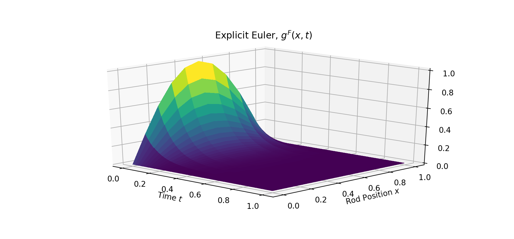
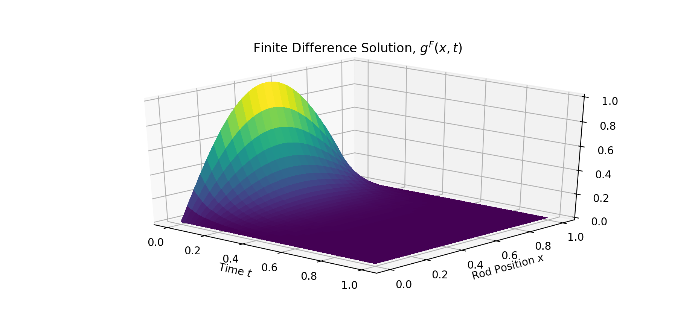

```{r setup, include=FALSE}
knitr::opts_chunk$set(echo = FALSE)
```

# Introduction

Like ordinary differential equations, partial differential equations are relevant to a great variety of scientific fields, due to their ability to mathematically describe important phenomena and behaviours. An example is the heat equation, which models heat flow through a physical object across time. Another is the Black-Scholes PDE, which is a modification of the heat equation, used to model financial derivative prices. 

As the availability of computational power has improved greatly in recent years, neural network models have seen a great deal of increase in interest and applications. Though they are mainly used to perform classification or prediction tasks, they can also be used to represent any functional maps, and/or learn these maps under some conditions.[@Goodfellow-et-al-2016]

Among the first to apply neural networks as means to provide solutions to partial differential equations were @Lagaris1998ArtificialNN. I apply this method to the heat equation, and compare the neural network solution to a finite difference approach using the explicit Euler method. Like the finite difference method, this neural network method requires a pre-defined grid on which a solution is obtained. 

A recent method for solving PDE’s with neural networks is the “Deep Galerkin Method” by Sirignano and Spiliopoulos [@Sirignano_2018]. This method is so-called “mesh-free”, since it does not require a pre-defined grid for developing a solution. As such, it can be applied to obtain solutions/approximations to high-dimensional PDE’s, where finite differences or other methods requiring a grid can become infeasible relatively quickly when the number of dimensions increase. In their paper they formulate a problem on a high-dimensional free-boundary version of the Black-Scholes PDE. For the second part of this project, I implement this method according to the paper by Sirignano and Spiliopoulos, and apply it to the Black-Scholes PDE to model an American call option on a single stock.

# Code

The GitHub repository at https://github.com/1991sig/fys-stk-project3 contains all code with implementations. With limited resources on my laptop, I used Google Colab for the neural network implementations and training, with GPU resources enabled. 

`Heat Equation - Finite Differences Solution.ipynb` contains the code to run and plot solutions to the heat equation with the explicit Euler method. The class object implementation of the heat equation and the explicit Euler method is implemented in the program `HeatEquation.py`.

`Heat Equation - Neural Network Model.ipynb` contains the TensorFlow implementation of a neural network model, and the code to train and plot the solution. To run, I recommend opening in Colab and ensuring that GPU processing is enabled. 

`Black-Scholes Equation -Deep Galerkin Method.ipynb` contains the TensorFlow implementation of the layer and model described in the DGM paper as well as the code to perform the training method described in the paper. Using Colab with GPU is also recommended here.


# Theory & Methods

A brief presentation of the theories and methods used in this project is in order.

## The Heat Equation

The heat equation describes the distribution of heat/thermal energy in a physical object over time. The item of interest/the unknown in this equation is a function of the position in the object, x, and the time, t.

$$\frac{\partial u}{\partial t} - \frac{\partial^2 u}{\partial x^2} = 0$$

For this problem, we use a uniform rod of length $L=1$. This means the unknown function is 2-dimensional, since the rod is 1-dimensional, and we have the time dimension. 

Initial value conditions:

$$u(x, 0) = sin(\pi x)$$ for $x \in (0, L)$

Boundary conditions:

$$u(0, t) = u(L,t) = 0 $$

By separation of variables, and qualitatively assessing the possible solutions, one arrives at analytical solution of:

$$u^*(x, t)=e^{-\pi^2 t}sin(\pi x)$$

#### Implementation

### Neural Network Approach
The idea behind the method proposed by @Lagaris1998ArtificialNN is to define a trial solution taking a function of the form $g_t(t, x) = h_1(t, x) + h_2(t, x, N(X))$ where N is the neural network model taking inputs x.

Using the conditions of the heat equation, we seek to specify the trial solution function so that these conditions are satisfied.

For the heat equation problem defined above, this results in:

$$g_t(t, x) = (1 - t) u(x) + x (1 - x)t N(X)$$
where $X = [t, x]$

#### Implementation
For this problem, I have implemented a neural network model in TensorFlow consisting of three hidden layers, using the tanh activation function. A mesh of evenly spaced points are created, using 100 points in both x and t, which results in a grid of 100 * 100 $(x, t)$-coordinates. 

The loss function is the mean squared error of the heat equation PDE with the trial function replacing $u$:

$$MSE(\frac{\partial g_t}{\partial t} - \frac{\partial^2 g_t}{\partial x^2}, 0)$$

The training consists of:
1. Predicting the input matrix consisting of the coordinates in x and t on the grid 
2. Evaluating the trial solution
3. Obtaining the partial derivatives in x and t to produce the heat equation w.r.t. to the trial function. This is done using the autograd functionality provided in TensorFlow.
4. Evaluating the loss.
5. Performing weight updates using the Adam optimizer, w.r.t. to the loss.

## Black-Scholes Equation

The influence the Black-Scholes model has had on finance, and on derivatives pricing and trading in particular, is huge. So much so that Robert Merton and Myron Scholes were awarded the Nobel prize in economics in 1997. [@Hull]

Although the theories from finance and economics that underly the model and its assumptions are far too deep to go into in detail here, a short presentation is in order.

A stock option gives the holder the right to trade the underlying stock on a predefined date and for a predefined price. Specifically:

Case 1: 
Person A buys a European call option from Person B. This gives A the right to, but not the obligation to, buy a share from B at time $T$ for the price $K$. Thus, if the market price of the stock is greater than $K$ at time $T$, the pay-off at time $T$ is $S_t - K$. If $S_t$ is below $K$, then exercising the option is irrational, since he would be better off buying the stock in the market at the price $S_t$ than buying it from Person B for the price $K$.

Case 2:
Person A buys a European put option from Person B. This gives person A the right to, but not the obligation to, sell a share in the underlying company to Person B at time $T$ for price $K$. If the price of the stock is below the pre-agreed price $K$, then person A can buy a share at time $T$ for the price $S_t$ in the market, exercise his option and sell it to Person B for $K$. Thus making a payoff at time $T$ of $K - S_t$. If the market price $S_t$ is greater than $K$, person A would be better off not exercising the option and if he already owns the stock sell it on the market for $S_t$, or if not do nothing.

American options differ from European options by allowing the owner to exercise his option at any time from the start date to the end date, $t \in [0, T]$. For European options, the holder can only exercise the option specifically at time $T$. 

The theory and model(s) put forth by Fischer Black, Myron Scholes, and Robert Merton state that the value of a an option must satisfy the following equation:

$$\frac{\partial V}{\partial t} + rS\frac{\partial V}{\partial S} + \frac{1}{2}\sigma^2 S^2\frac{\partial^2 V}{\partial S^2} - rV = 0$$

Where $V(t, S)$ is the option value as a function of the market price of the underlying security and the time, $t$.
$\sigma^2$ is the volatility of the stock. 
$r$ is the rate of return on a risk-free investment. Usually, short- or medium-term investments in treasury bonds are used to estimate this.

For American options, this becomes a free-boundary problem, since the option can be exercised at any $t$ from $0$ to $T$.

### Implementation
In the “real world”, the Black-Scholes equation is usually extended by adding additional assumptions and dimensions, and when applied to more complicated financial derivatives than options, obtaining solutions can become difficult. One example, of this is for options on selections of multiple stocks. Common methods used to obtain solutions are finite differences, finite elements, and Monte-Carlo methods. 

The Deep Galerkin Method is especially relevant for Black-Scholes equations/models in high dimensions, and in cases where the boundary conditions are hard to incorporate in other numerical methods. My problem formulation and model implementations are based on the formulations in section 4.1 in the DGM paper [@Sirignano_2018]. I have opted to use only one underlying stock, whereas problem 4.1 in the paper proposes using 100. Since the training process and loss function is described very detailed in the paper, I will present them in a shorter version here.

For this problem, the approximated solution to the unknown function $V(t, S)$ is the output from the neural network directly. 

The model consists of three layers with LSTM-architecture. I have implemented a version of this in TensorFlow based on the descriptions in the DGM paper, by subclassing the `layer` class in Keras.

All in all, the model architecture is:

- one hidden layer with tanh activation 
- three DGM-layers with tanh activation 
- one linear output layer

The authors define the following training process:

1. Generate samples from “inside” the grid -> B1
2. Generate samples from points on the boundary of the grid -> B2
3. Generate samples from the market value interval -> B3
4. Predict the model output of the samples
5. Generate the Black-Scholes PDE using the approximated $V(t, s)$, i.e. the neural network output, and autograd functionality in TensorFlow.
6. Evaluate the loss.
7. Update weights w.r.t. the loss using the Adam optimiser.

Although the authors specify the loss to be evaluated on a “filtered" version of the sampled points, I chose not to do this, since it seemed to interfere with the convergence during training.

The loss is evaluated as the sum of:

1. The MSE of the NN-output Black-Scholes PDE evaluated on samples B1
2. The MSE of $max(g - NN_{output}, 0)$ evaluated on samples B2
3. The MSE of $NN_{output} - g$ function evaluated on samples B3

where $g$ is the payoff function.

# Results

## Heat Equation
When using the explicit Euler method, and step lengths $dx=0.1$ and $dt=\frac{1}{2}{dx^2}$
we obtain the plot shown in figure 1.

```{r, out.width='100%', fig.align='center', fig.cap='Explicit euler solution, $dx=0.1$, $dt=0.5dx^2$'}

```

The maximal error in absolute value between the analytical solution and the Euler approximation is $Max(e) \approx 0.0025776$

Then, using step lengths $dx=0.01$ and $dt=\frac{1}{2}{dx^2}$ the maximum error becomes $Max(e) \approx 6.0525e-05$. A plot of the solution is shown in figure 2.


```{r, out.width='100%', fig.align='center', fig.cap='Explicit euler solution, $dx=0.01$, $dt=0.5dx^2$'}

```


The difference between the analytical solution and the approximated solutions for the two grids is shown in figure 3.

```{r, out.width='100%', fig.align='center', fig.cap='Left: first grid, Right:second grid'}
library(png)
library(grid)
library(gridExtra)
img1 <-  rasterGrob(as.raster(readPNG('plots/Figure 4.png')), interpolate = FALSE)
img2 <-  rasterGrob(as.raster(readPNG('plots/Figure 5.png')), interpolate = FALSE)
grid.arrange(img1, img2, ncol = 2)
```

As expected, the overall errors are much smaller on the grid with $dx=0.01$ than when using $dx=0.1$.

Using the neural network model solution, the maximum error is $Max(e)\approx 0.163648$. Figure 4 shows the model solution and the analytical solution.

```{r, out.width='100%', fig.align='center', fig.cap='Left: Neural Network Solution, Right: Analytical Solution'}
img3 <-  rasterGrob(as.raster(readPNG('plots/Figure 6.png')), interpolate = FALSE)
img4 <-  rasterGrob(as.raster(readPNG('plots/Figure 7.png')), interpolate = FALSE)
grid.arrange(img3, img4, ncol = 2)
```


The difference between the analytical solution and the model solution is seen in figure 5.


```{r, out.width='100%', fig.align='center', fig.cap='Difference between the analytical and model solutions'}

```


## Black-Scholes Equation

The example used, is one a one-year American call option on Apple stock. 

The closing price of Apple on 18.12.2019 was $279.74. For the example, I use the 180 day volatility, [estimated at](https://www.alphaquery.com/stock/AAPL/volatility-option-statistics/180-day/historical-volatility) 23.17%.

To estimate the risk free rate, the [10-year U.S. Treasury rate](https://ycharts.com/indicators/10_year_treasury_rate) is often used. This stood at 1.92% on 18.12.2019. 

The strike price is set at 10% above the market price of $279.74.

An adjustment I have made in this case is that Apple pays dividends, which can be incorporated into to the Black-Scholes model. However, I disregarded this fact, so the results is not entirely realistic.

The plotted value function of a call option on Apple with strike price $307.714 is shown below. 

In particular, the predicted value today of this option, when disregarding the dividends is $17.1387. 
Using an option price calculator from CBOE, the estimated price was $17.1940, which is quite close to this result.


```{r, out.width='100%', fig.align='center', fig.cap='Option value function, 1 year American call, K = 307.714'}

```


# Conclusion & Discussion

Using neural networks to approximate solutions via the methodology described by Lagaris et al seems to work reasonably well, but when taking into account the resources and time needed to implement and train a model to do this is not that easily justified when comparing the results from using finite difference methods. The solution obtained from the explicit Euler methods are both far faster to calculate, and more accurate in this case. However, it is likely that a more accurate result could be obtained if I had increased number of hidden units, layers, and/or made other tweaks. In addition, the specific example of the heat equation we solved is not that complex and analytical examples can be found. The method might be far more useful in cases where PDE solutions are harder or infeasible to obtain via numerical methods, or when there are no analytical solutions. 

Applying the Deep Galerkin method to the option pricing problem is likely also an "overkill", since other methods exist. My intention was to implement the model on a problem in high dimensions, but unfortunately I was not able to finish this in time. In any case, this method looks very interesting since higher dimension problems can be studied, and points from the domain can be sampled easily. Upon finishing this project, I also discovered a paper by @alaradi2019applications applying the DGM method in much the same way as I did, so it was interesting seeing that many of their implementations were quite similar to mine. But unfortunately, they beat me to it.


# References


